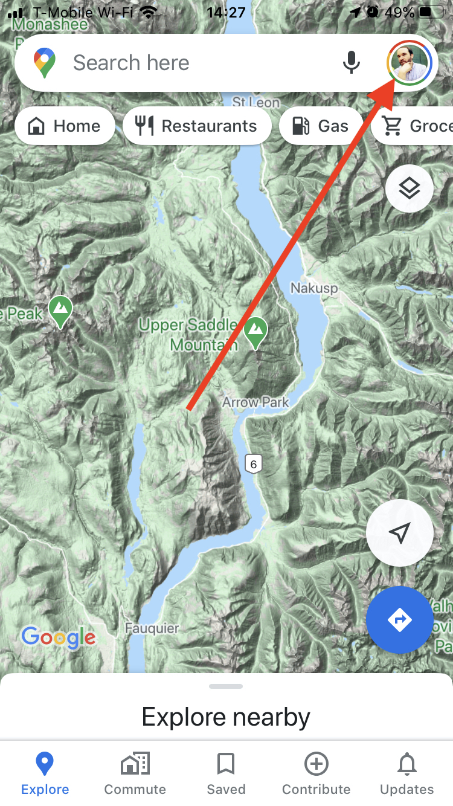
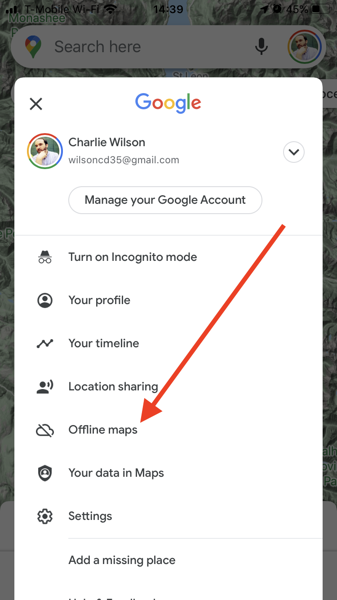
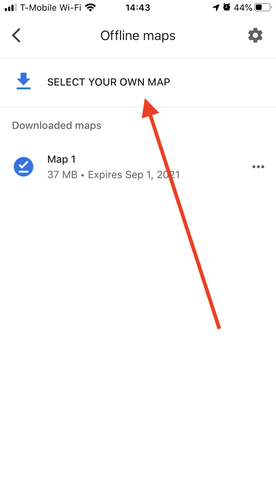
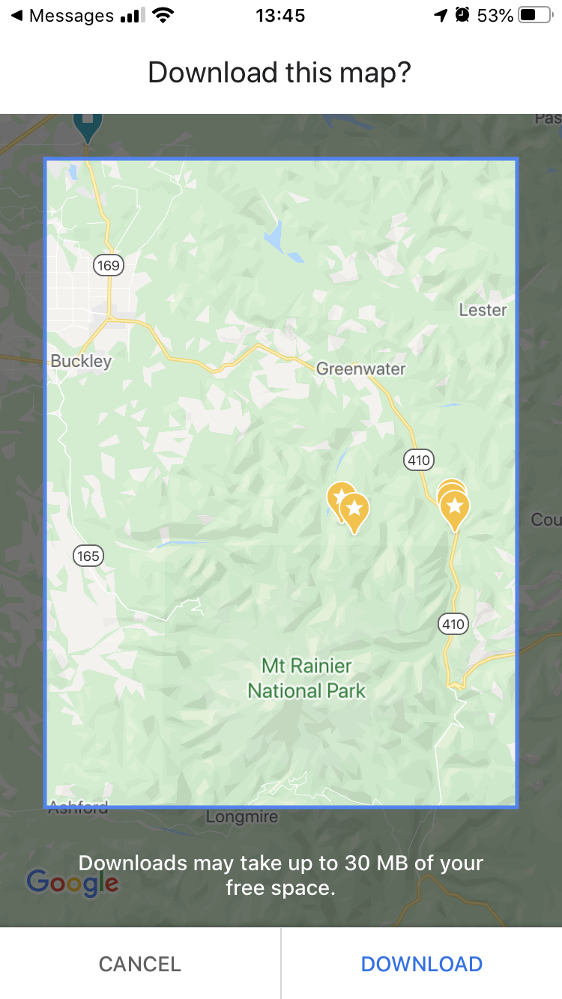

## Google Maps for IOS - Offline Maps

Download a region in Google Maps on an Appled IOS device so that you will have map data for navigation when outside of cell service.

1. Log in to Google from Google Maps.
1. Search Enumclaw, WA.
1. Choose your profile icon in the top right corner of the app screen.

    

1. Choose Offline Maps.

    ]

1. Choose Select Your Own Map.

    

1. The map will show again. Resize the map so that a large region around Enumclaw, WA, and Greenwater, WA, are in the frame.

    

1. Choose Download.
